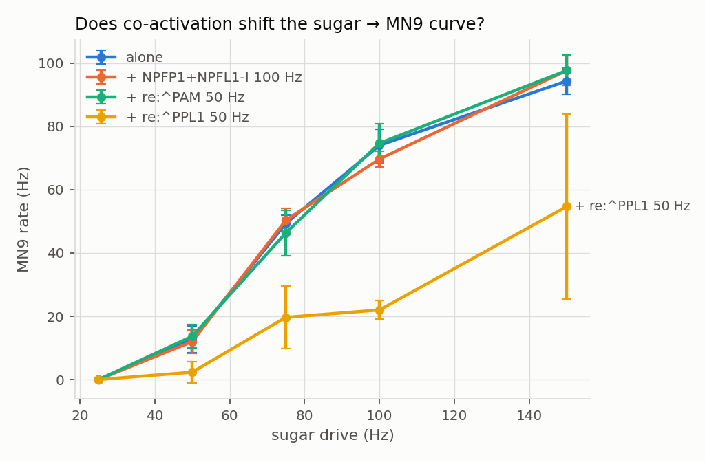

# flybrain-sim

`flybrain-sim` simulates the whole adult *Drosophila* brain. The wiring comes from the
FlyWire connectome. You choose a group of neurons and set their firing rate. The model then
shows you how the other 138,000 neurons respond.

The model has 138,639 neurons, 15,091,983 connections and 54,492,920 synapses. It depends on
NumPy, SciPy, pandas, matplotlib, imageio and loguru.

The worked example is the taste reflex. When sugar touches the labellum of a real fly, the fly
extends its proboscis to drink. In the model, we drive the sugar-sensing gustatory receptor
neurons (GRNs). We read out one motor neuron, MN9. If MN9 fires, the virtual fly extends its
proboscis.

## Quick start

Create the environment and install the dependencies:

```bash
uv venv && source .venv/bin/activate
uv pip install -r requirements.txt
```

Run the demonstration. It takes about three minutes and writes `results/taste_to_per.png`
and four CSV files:

```bash
python3 run_demo.py --quick
```

Make the movie. It takes about two minutes and writes `results/taste_episode.mp4`:

```bash
python3 make_movie.py
```

Open the notebook for an interactive walk-through:

```bash
jupyter lab notebooks/explore_taste_circuit.ipynb
```

The Python interface is small. This example drives the sugar neurons at 100 Hz for one
second. MN9 fires at about 60 Hz.

```python
from flybrain import Connectome, LIFNetwork, circuits

connectome = Connectome()
network = LIFNetwork(connectome)

sugar = tuple(connectome.index(circuits.SUGAR_GRN).tolist())
mn9 = connectome.index(circuits.MN9)

result = network.run({sugar: 100.0}, t_run=1.0)
print(result.rate(mn9), "Hz")
result.table(min_rate=1.0, top=20)
```

## What the demonstration reproduces

`run_demo.py` reproduces four results from Shiu et al. (2024). The table compares them.

| Input | What MN9 does | Why it matters |
|---|---|---|
| Sugar GRNs from 25 Hz to 200 Hz | MN9 rises from 0 Hz to about 105 Hz. The rise is smooth. MN9 stays silent below about 50 Hz of input. | The response is graded and has a threshold, as in the real fly. |
| Bitter GRNs or Ir94e GRNs at any rate | MN9 stays silent. | The response is specific to the sugar pathway. The model does not fire MN9 for every sensory input. |
| Water GRNs | MN9 stays silent below about 150 Hz. Above that, MN9 fires. | Real flies also need a stronger water stimulus than sugar stimulus. The model reproduces this difference in threshold. |
| Sugar GRNs at 100 Hz plus bitter GRNs | MN9 falls as the bitter rate rises. MN9 reaches 0 Hz at about 100 Hz of bitter input. | No code implements this suppression. The bitter GRNs excite inhibitory interneurons. Those interneurons project onto the sugar pathway. At MN9, the inhibition wins. |


## Watching it happen

`make_movie.py` simulates one 2.4-second episode and renders it as a movie. The episode has
four parts:

1. The brain is quiet.
2. The sugar neurons fire for 0.7 seconds.
3. The brain is quiet again.
4. The sugar neurons and the bitter neurons fire together.

The movie shows the brain in two anatomical views. Beside them, a proboscis extends in
proportion to MN9's firing rate.


Each dot is one neuron at its real position in the FAFB brain volume. The positions come from
the FlyWire annotation release. When the sugar neurons fire, a bright cluster appears on the
ventral midline. This region is the sub-oesophageal zone, and it processes taste in the real
fly. The code does not place the activity there. The activity appears there because the
responding neurons are there.

MN9 is the one orange dot. It lights only when MN9 fires. The blue glow around it belongs to
its neighbours.

Each rendered episode also produces an interactive page at `results/<name>/<name>.html`.
Drag through time on the page. At each instant, the page names the neurons that fire most
strongly, by their FlyWire cell type.

## Run any circuit with one command

`run_episode.py` drives any named group of neurons and reports the neurons that responded.
These four commands show the range:

```bash
# Drive the looming-detecting visual neurons. Read out the Giant Fiber escape neuron.
python3 run_episode.py --drive LC4:200 --readout DNp01@right --name escape --render

# Present a food odour, then the smell of toxic mould. Compare the descending neurons.
python3 run_episode.py --drive "ORN_DM4+ORN_DM2:100:0.4-1.1" --drive "ORN_DA2:100:1.5-2.2" --name valence --render

# Silence every PAM dopamine neuron during a sugar response.
python3 run_episode.py --drive sugar:100 --silence re:^PAM --readout MN9

# List the cell types whose name contains "DNp".
python3 run_episode.py --search DNp
```

Name a group of neurons in one of these ways. The names come from the FlyWire annotations.

| Form | Example | Meaning |
|---|---|---|
| Exact cell type | `LC4`, `DNp09`, `PAM01` | All neurons of that type. |
| Regular expression | `re:^PAM` | All types that match the expression. |
| Class | `class:motor` | All neurons in one super class. |
| Root IDs | `id:720575940660219265` | The listed FlyWire root IDs. |
| Union | `ORN_DM4+ORN_DM2` | Both groups together. |
| One side | `LC4@left` | Only the left hemisphere. |

`run_sweep.py` asks one question: does a co-activated circuit change the input-output curve
of another circuit? It measures the dose-response of a driven group on a readout neuron. It
measures the curve alone first. Then it adds each co-activated group at a fixed rate and
measures again. It reports how far each curve moved.

```bash
python3 run_sweep.py --drive sugar --rates 25,50,75,100,150 --readout MN9 \
    --co "NPFP1+NPFL1-I:100" --co "re:^PAM:50" --co "re:^PPL1:50"
```

Read the section on the model's limits before you interpret a sweep. The model has only fast,
signed synapses. A co-activated dopamine neuron therefore acts as a brief excitatory input. If
the curve shifts, the wiring alone carries part of the effect. If the curve stays, you have
measured how much of that internal state depends on slow chemistry that the model lacks.

## Three experiments and their results

The commands above produced these results. The outputs are in `results/escape`,
`results/valence` and `results/sweeps`.

**Escape.** We drove the 104 LC4 looming detectors at 200 Hz. The Giant Fiber (DNp01) fired
at about 140 Hz on both sides. The descending neurons DNp02, DNp04, DNp05 and DNp11 fired too.
Von Reyn et al. (2017) and Ache et al. (2019) found the same set of looming-responsive neurons
in real flies. The network settled as soon as the input stopped. This experiment shows the
model works as intended.

**Hunger.** We ran the sugar dose-response with the four NPF neurons at 100 Hz, and again
with all 307 PAM dopamine neurons at 50 Hz. The MN9 curve stayed in place. The mean shifts
were −0.1 Hz and +0.4 Hz. This is a clean negative result. The wiring alone carries no hunger
gain. In the real fly, hunger changes this gain through slow neuromodulation, and the model
lacks that mechanism. The PPL1 dopamine neurons at 50 Hz did lower MN9 by 26 Hz on average.
The next paragraph explains why you should distrust that number.



**Olfaction runs away.** Any input to the antennal lobe ignites a self-sustaining state. Even
40 olfactory receptor neurons at 10 Hz for 100 ms are enough. About 10,000 neurons then fire
without end. They include Kenyon cells, projection neurons, lateral horn neurons, local
interneurons and the receptor neurons themselves. We silenced every dopamine neuron, and the
state persisted. We silenced every Kenyon cell, and the state persisted. The loop is therefore
in the antennal lobe and the lateral horn. In the real fly, slow GABA-B inhibition of the
receptor terminals holds this loop in check. GABA-B is metabotropic, so the model lacks it.
`run_episode.py` warns when a run has not settled. In an olfactory experiment, trust only the
first 100 ms of the response. The PPL1 result above arrived with this runaway state. Its
apparent suppression of MN9 is a side effect of the runaway.

## What is in the repository

The `flybrain/` package holds the model:

- `connectome.py` loads the FlyWire v783 connectivity into a signed sparse weight matrix.
- `lif.py` implements the leaky integrate-and-fire dynamics. It stimulates, silences and records neurons.
- `circuits.py` lists the FlyWire root IDs of the sugar, bitter, water and Ir94e GRNs and MN9.
- `anatomy.py` attaches soma coordinates and cell-type annotations to every neuron.
- `names.py` turns names such as `LC4`, `re:^PAM` and `class:motor` into model indices.
- `viz.py` rasterises the brain views and draws the proboscis rig.
- `render.py` produces the movie and the data for the interactive page.
- `page/` holds the template for the interactive page.
- `logging_setup.py` configures loguru for the scripts.
- `minipq.py` and `tcompact.py` read the Parquet connectivity file. They remove the need for pyarrow.

The scripts at the top level run the experiments:

- `run_demo.py` reproduces the four taste results and the figure.
- `run_episode.py` drives any named group, reports the responders, and renders on request.
- `run_sweep.py` measures a dose-response alone and with co-activated groups.
- `make_movie.py` runs the sugar-and-bitter episode through `run_episode.py`.
- `bitter_sweep.py` measures the bitter dose-response with six trials per point.

The other folders hold data and outputs:

- `data/` holds the FlyWire connectivity, the neuron list and the annotations, about 107 MB. `data/README.md` says how to download them.
- `body/` holds notes on a physical body and an untested FlyGym script.
- `notebooks/` holds the interactive walk-through.
- `results/` receives the CSV files, figures, movies and logs.

## Logging

Every script logs through loguru. The console shows INFO and above. The file
`results/flybrain.log` receives DEBUG and above. Add `--verbose` to show DEBUG on the console.

## The body

The proboscis in the movies is a kinematic rig. A low-pass filter smooths MN9's firing rate.
The filtered rate sets two joint angles. The rig shows the motor command faithfully. It has no
mass, no contact and no gravity.

A physical fly needs MuJoCo, through FlyGym (NeuroMechFly) or flybody. `body/flygym_per.py`
connects MN9 to a FlyGym proboscis. It has never run, because the build environment had no
package index. Read `body/README.md` before you rely on it.

## The model

Each neuron is one leaky integrate-and-fire unit with the parameters of Shiu et al. (2024).

| Parameter | Value |
|---|---|
| Resting and reset potential | −52 mV |
| Spike threshold | −45 mV |
| Membrane time constant | 20 ms |
| Synaptic time constant | 5 ms |
| Refractory period | 2.2 ms |
| Synaptic delay | 1.8 ms |
| Weight per synapse | 0.275 mV. This is the single free parameter. |

A connection's weight is its synapse count times 0.275 mV. FlyWire's predicted
neurotransmitter gives the sign. 40% of connections are inhibitory. A stimulated neuron
receives Poisson drive strong enough that every event evokes a spike. A neuron driven at
100 Hz therefore fires at 100 Hz.

## What this model does not know

This section matters more than any result above. The anatomy is real. The physiology is
assumption. These limits decide what the results can mean.

- **Synaptic strength.** The model uses synapse count as a proxy for strength. On average
  the proxy is reasonable. A two-synapse connection on a sensitive dendrite can still
  outweigh a twenty-synapse connection elsewhere.
- **Neuromodulation.** Dopamine, octopamine, serotonin and neuropeptides reconfigure fly
  behaviour constantly. Hunger alone changes the sugar-to-proboscis gain many-fold. The
  model has none of this.
- **Slow synapses.** Every synapse gives a brief push to the target's membrane potential,
  with a positive or negative sign. The model signs the neuromodulators positive and treats
  them like acetylcholine. GABA-B receptors are absent. This is why the model can locate an
  internal state but cannot simulate it. It is also why the olfactory system runs away.
- **Neurotransmitter sign.** The predictions are about 87% accurate. The sign of a connection
  is the most consequential number in the model.
- **Intrinsic diversity.** Every neuron has the same time constants and threshold. Real
  neurons differ in excitability by cell type.
- **Gap junctions.** The connectome maps few of them. The model has none.
- **Plasticity.** The model has none. Nothing in it can learn.
- **Position.** The model draws each neuron as one dot. The dot sits at the soma for 85% of
  cells and at an anchor point on the arbour for the rest. A real neuron spans several
  neuropils. A lit dot means the cell fired. It does not mean the region around the dot is active.
- **One brain.** FlyWire is one adult female. The ventral nerve cord is a separate dataset.
  Everything below the neck is out of scope.
- **Calibration.** The firing rates are uncalibrated. Trust which neurons respond and the
  sign of an effect. Distrust absolute rates and millisecond timing. Treat every output as a
  hypothesis to test in a fly.

## Sources and licence

The soma positions and cell types come from Schlegel et al., *Nature* (2024). The release is at
[flyconnectome/flywire_annotations](https://github.com/flyconnectome/flywire_annotations)
under CC-BY-NC.

The connectome data and the model parameters come from Shiu, Sterne, Spiller et al., *Nature*
(2024). The paper is titled "A leaky integrate-and-fire computational model based on the
connectome of the entire adult *Drosophila* brain reveals insights into sensorimotor
processing". The data files and the identities of the GRNs and MN9 come from
[philshiu/Drosophila_brain_model](https://github.com/philshiu/Drosophila_brain_model), under
the MIT licence.

Dorkenwald et al. and Schlegel et al., *Nature* (2024), describe the FlyWire connectome.
FlyWire data is CC-BY-NC. Cite FlyWire if you publish work derived from this project.

This code is a fresh NumPy and SciPy implementation. It shares no code with the original
Brian2 model.
